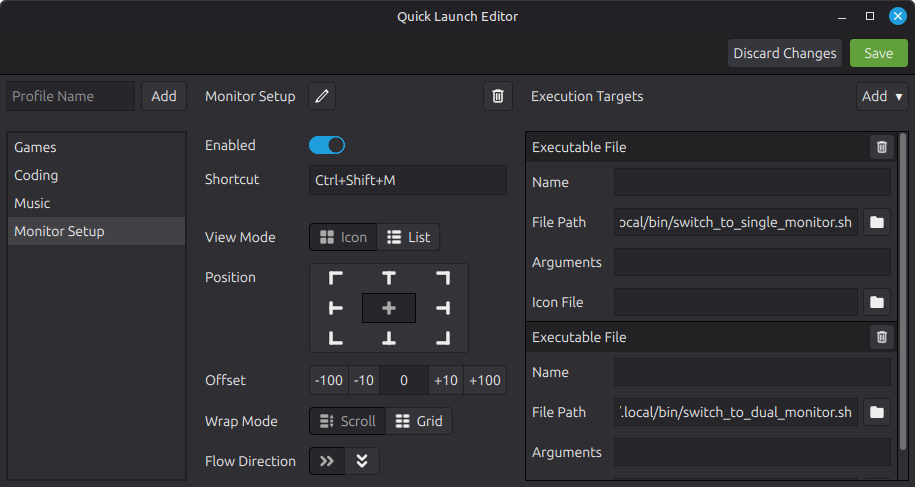
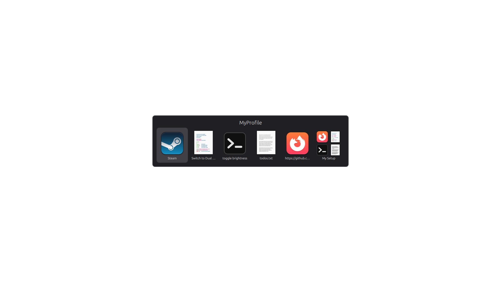

# QuickLaunchBar

QuickLaunchBar is a desktop application where you can edit, open and launch custom collections of applications with global shorcuts (similar to Alt-Tab).




## Features

- **Works on Linux**
- **Create Collections of Applications**
  - create a profile
  - set a global shortcut
  - add applications, files, commands and more
- **Open and Launch Profiles**
  - open the profile with the shortcut
  - select the target and launch it

## Installation

The packages are available on the [release page](https://github.com/Clashy13/quicklaunchbar/releases).<br>
Download and install it.

### Linux

- #### Debian
  ```bash
  sudo apt install <package>
  ```
- #### Arch Linux
  ```bash
  sudo pacman -U <package>
  ```
- #### Fedora
  ```bash
  sudo dnf install <package>
  ```

## Usage

- Open the `Quick Launch Editor`
- create your first profile by entering a name
- enter a shortcut by pressing the keys
  - you need zero or more modifiers (Ctrl, Shift, Alt) and one key
- add your desktop application, script, command, file or url
- customize the way its being displayed
- save it
- then press shortcut and select your target to launch/open

## Known Limitations

- The limitations stem mostly from [Skycoder42](https://github.com/Skycoder42)'s [QHotkey](https://github.com/Skycoder42/QHotkey) class i am using for the global shortcuts.
- In short, on Linux it only works on X11 distributions or it would at least need X11 support like XWayland.
